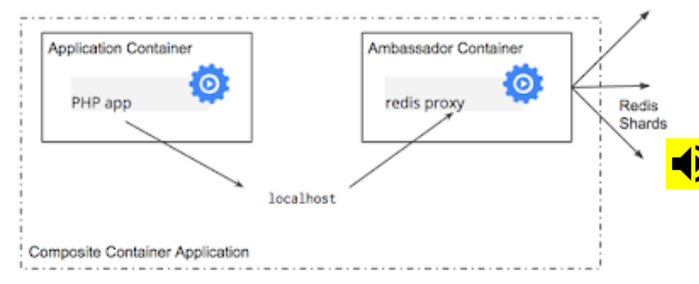

## Pod
  [参考文章](https://kubernetes.io/blog/2015/06/the-distributed-system-toolkit-patterns/)
  kubernetes里管理的原子调度单位（最小单位）--pod（由一组容器--多个容器）组成）。
  Pod中可以实现简单的以多个容器模拟运行传统环境下多个线程的协同工作。同一个Pod中的容器会自动的分配到同一个node上。同时pod内的容器之间可以共享资源 ， 例如文件系统，内核命内核命名空间和IP地址，它们总是被同时调度。
  设计的场景例子如下，你有一个容器作为web服务器运行，需要用到共享的volume，或者你需要一个单独的容器（进程）来获取远端的资源更新。

三种组织模式：
* Sidecar容器
  考虑运行Nginx Web服务器的容器。 添加一个不同的容器，将文件系统与git存储库同步，在容器之间共享文件系统，并且您已经构建了Git推送式部署但是，您已经以模块化的方式完成了git同步器可以由不同团队构建的模式，并且可以在许多不同的Web服务器（Apache，Python，Tomcat等）上重用。 由于这种模块化，您只需编写和测试一次git同步器，并在多个应用程序中重复使用它。 如果有人写它，你甚至不需要那样做。
  
* Ambassador 大使容器
  请考虑具有只读副本和单个写入主节点的Redis群集。 您可以创建一个Pod，将主应用程序与Redis大使容器分组。 大使是一个代理，负责分割读写，并将它们发送到适当的服务器。 由于这两个容器共享一个网络名称空间，因此它们共享一个IP地址，并且您的应用程序可以在“localhost”上打开一个连接，并在没有任何服务发现的情况下查找代理。 就您的主应用程序而言，它只是连接到本地主机上的Redis服务器。 这是非常强大的，不仅因为关注的分离以及不同团队可以轻松拥有组件的事实，而且因为在开发环境中，您可以直接跳过代理并直接连接到在本地主机上运行的Redis服务器。
  

* Adapter 容器
  适配器容器标准化并标准化输出。 考虑监视N个不同应用程序的任务。 每个应用程序都可以用导出监控数据的不同方式构建。 （例如JMX，StatsD，特定于应用程序的统计），但是每个监控系统都希望为其收集的监控数据提供一致且统一的数据模型。 通过使用复合容器的适配器模式，您可以通过创建Pod来将来自不同系统的异构监视数据转换为单一统一表示，该Pod使用知道如何进行转换的适配器对应用程序容器进行分组。 同样，因为这些Pod共享名称空间和文件系统，所以这两个容器的协调很简单直接。
  
