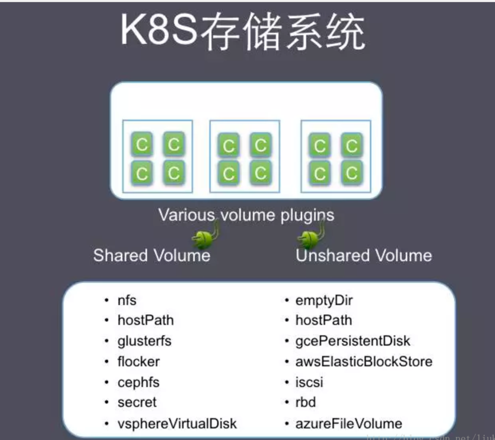
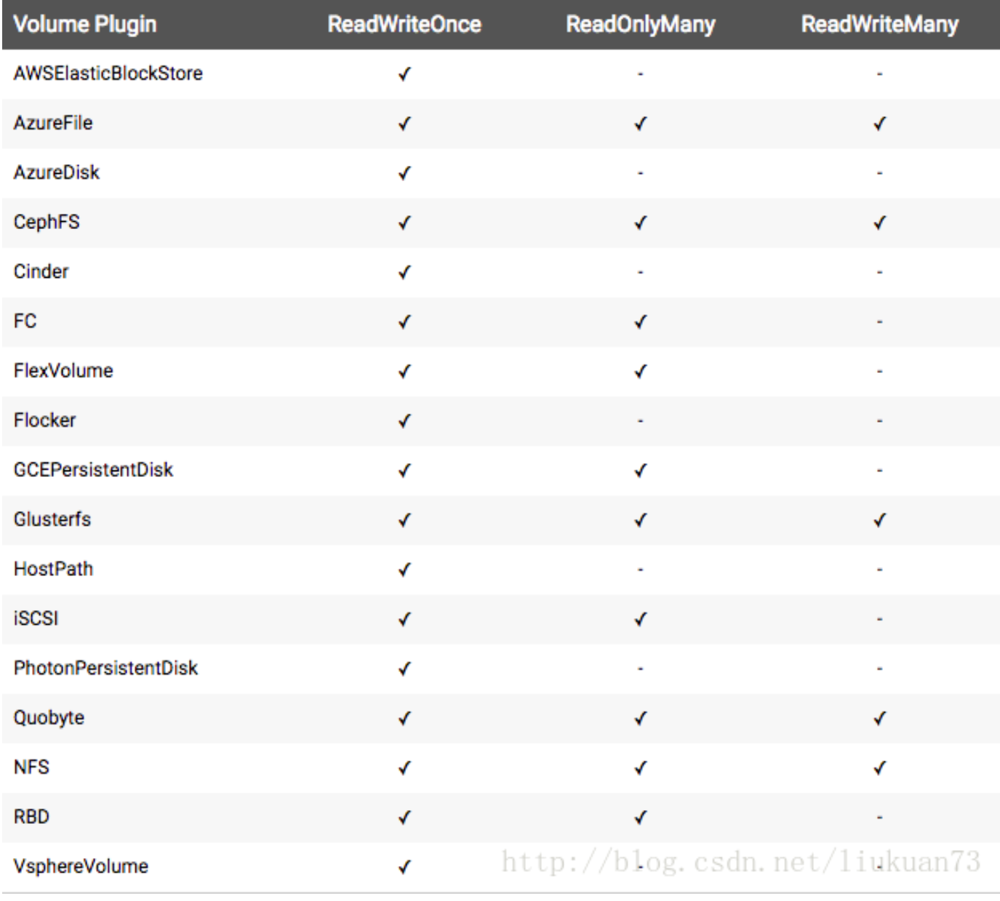
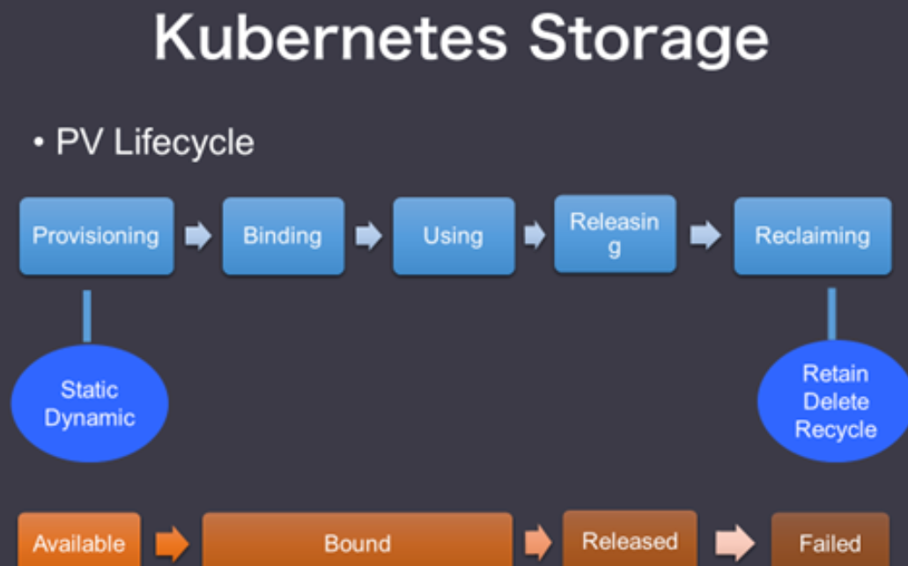

<!-- @import "[TOC]" {cmd="toc" depthFrom=1 depthTo=6 orderedList=false} -->
<!-- code_chunk_output -->

* [一、 分类数据持久化及存储机制](#一-分类数据持久化及存储机制)
	* [1. 后端解决方案维度](#1-后端解决方案维度)
	* [2.  编排调度使用维度](#2-编排调度使用维度)
* [二、rancher cattle 下的volume (存储)概念简述](#二-rancher-cattle-下的volume-存储概念简述)
* [三、 kubernetes volume 概念及分类](#三-kubernetes-volume-概念及分类)
	* [1.   普通volume](#1-普通volume)
	* [2. persistent volume](#2-persistent-volume)
	* [3. 动态存储供应（dynamic provisioning）](#3-动态存储供应dynamic-provisioning)
* [三、 迁移中涉及的存储（volume)机制改变及优化建议](#三-迁移中涉及的存储volume机制改变及优化建议)

<!-- /code_chunk_output -->

### 一、 分类数据持久化及存储机制
应用容器化已成为复杂企业环境中的流行选择。 但是，随着企业采用容器，他们需要一个提供HA，备份，快照，加密，监控集成等的存储解决方案。 而且现在的趋势是，越来越多的企业选择在容器上运行诸如MySQL，Cassandra，Redis，Postgres或任何其他有状态服务的应用程序, 平台级的数据持久化方案的优劣成为容器编排领域造型的不可或缺的组成部分。

在一个容器编排的平台层面如何实现容器持久化存储通常会有几个不同的考量维度，

####   1. 后端解决方案维度
   比如使用Gluster、Ceph 开源方案， 或IBM Ubiquity + GPFS企业级方案， 或干脆购买硬件存储设备
####   2.  编排调度使用维度
   在rancher 是指convory 之类在paas平台层面管理存储资源的方案
  在k8s 是指象普通Volume，Persistent Volume 和动态存储供应(dynamic provisioning)。

### 二、rancher cattle 下的volume (存储)概念简述
   在民生rancher测试环境下，通常使用的持久化数据的方式包括：
   #### 2.1 hostpath机制
   * 普通 hostpath 机制：
   普通主机持久性引起的主要问题是，它完全破坏了容器的可移植性。
   * 结合分布式存储系统的hostpath(民生没有分布式存储)
   通过多主机持久性使用分布式文件系统，来复制跨多个主机服务器的持久性存储。
   #### 2.2 块存储机制
   * Rancher Labs推出了自己的分布式块存储项目，名为Project Longhorn。Longhorn背后的基本思想相对简单。
   存储系统可以包含多个块存储volumes，并且这些volumes中的每一个只能由单个主机加载。在这种情况下，Longhorn试图将块存储控制器划分为大量较小的块存储控制器，每个存储控制器都可以映射到不同的块存储volume。如果所有这些块存储volumes都驻留在物理磁盘的公共池中，那么Longhorn方法将允许编排引擎根据需要创建块存储volumes。例如，可以在创建容器的同时自动创建块存储volume。

结论：块存储比文件系统存储更灵活，这样更容易适应容器环境的块存储。唯一的挑战是确保块存储数据在由多台主机组成的环境中可用。这可以通过分布式存储来解决。

### 三、 kubernetes volume 概念及分类

#### 1.   普通volume
  * 单节点Volume
  和Docker的存储卷类似，使用的是Pod所在K8S节点的本地目录 ，有两种
      * 1.  emptyDir，是一个匿名的空目录，由Kubernetes在创建Pod时创建，删除Pod时删除。
      * 2. hostPath，与emptyDir的区别是，它在Pod之外独立存在，由用户指定挂载到宿主机的路径
  *  跨节点volume
      这种存储卷不和某个具体的K8S节点绑定，而是独立于K8S节点存在的，整个存储集群和K8S集群是两个集群，相互独立， 包括如下：

      
#### 2. persistent volume
   通常的普通volume 不是独立的k8s资源 ， pv 是独立的k8s 资源 ， 它不和pod发生关系，而是通过pvc(persistent volume claim)实现绑定， pod里绑定的是pvc，而不是pv
   PV的访问模式
   ReadWriteOnce：是最基本的方式，可读可写，但只支持被单个Pod挂载
   ReadOnlyMany：可以以只读的方式被多个Pod挂载
   ReadWriteMany：这种存储可以以读写的方式被多个Pod共享。不是每一种
   存储都支持这三种方式，像共享方式，目前支持的还比较少，比较常用的是NFS。
   
   在PVC绑定PV时通常根据两个条件来绑定，一个是存储的大小，另一个就是访问模式。比如，一个配置了许多50Gi PV的集群不会匹配到一个要求100Gi的PVC。 只有在100Gi PV被加到集群之后，这个PVC才可以被绑定。
  
  静态，是管理员手动创建一堆PV，组成一个PV池，供PVC来绑定。

动态，是指在现有PV不满足PVC的请求时，可以使用存储分类(StorageClass)，描述具体过程为：PV先创建分类，PVC请求已创建的某个类（StorageClass）的资源，这样就达到动态配置的效果。即通过一个叫 Storage Class的对象由存储系统根据PVC的要求自动创建。
在实际使用场景里，PV的创建和使用通常不是同一个人。这里有一个典型的应用场景：管理员创建一个PV池，开发人员创建Pod和PVC，PVC里定义了Pod所需存储的大小和访问模式，然后PVC会到PV池里自动匹配最合适的PV给Pod使用。
回收策略
现有回收策略有：

Retain – 手动重新使用
Recycle – 基本的删除操作 (“rm -rf /thevolume/*”)
Delete – 关联的后端存储卷一起删除，后端存储例如AWS EBS, GCE PD或OpenStack Cinder
目前只有NFS和HostPath支持回收，AWS EBS, GCE PD和Cinder volumes只支持删除。
卷的状态
卷有四种状态，一个卷必属于其中之一:

Available –闲置状态，没有被绑定到PVC
Bound – 绑定到PVC
Released – PVC被删掉，资源没有被在利用
Failed – 自动回收失败
#### 3. 动态存储供应（dynamic provisioning）
* 静态和动态。
动态卷供给是一个 Kubernetes 独有的功能，这一功能允许按需创建存储卷。在没有这种能力之前，集群管理员需要打电话给他们的云或者存储提供者来创建新的存储卷，成功以后再创建 PersistentVolume对象，才能够在 Kubernetes 中使用。
其中动态方式是通过StorageClass来完成的，这是一种新的存储供应方式。
使用StorageClass有什么好处呢？除了由存储系统动态创建，节省了管理员的时间，还有一个好处是可以封装不同类型的存储供PVC选用。在StorageClass出现以前，PVC绑定一个PV只能根据两个条件，一个是存储的大小，另一个是访问模式。在StorageClass出现后，等于增加了一个绑定维度。

比如这里就有两个StorageClass，它们都是用谷歌的存储系统，但是一个使用的是普通磁盘，我们把这个StorageClass命名为slow。另一个使用的是SSD，我们把它命名为fast。

###  三、 迁移中涉及的存储（volume)机制改变及优化建议

  基于原有rancher 环境与现有k8s环境存储的实现方式不同，建议在应用改造时分几个情况
	1. 原有使用hostpath机制本地存储的，可分两种情况：
	 hostpath —————— 主机挂载nfs的目录 （此种实际上应用需要多容器访问或跨节点访问）      建议改到静态pv + pvc 模式
	 hostpath —————— 主机目录（非nfs挂载点）
	 视数据生命周期情况
	  *  可以在容器（POD)删除时删掉的 ， 建议使用emptyDir，
	   emptyDir是一个匿名的空目录，由Kubernetes在创建Pod时创建，删除Pod时删除。
	  * 需要在主机保留的 ，使用k8s hostPath
		需要注意的时，hostpath 往往需要配合调度使用，因为pod“迁移”或在别的节点运行后将找不到原来的hostpath 下的数据 。
