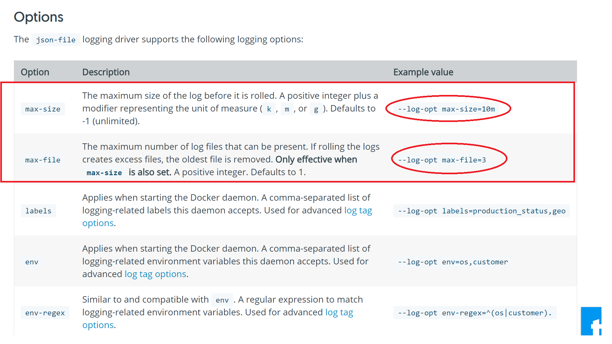
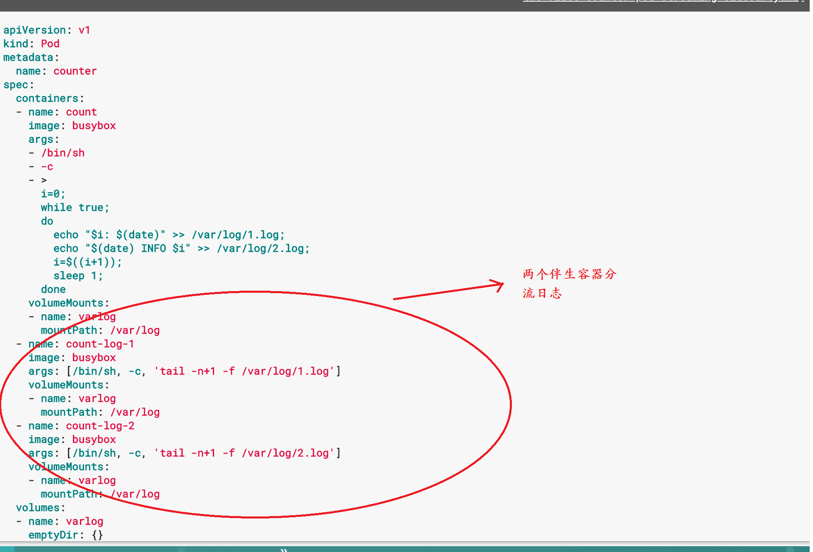

<!-- @import "[TOC]" {cmd="toc" depthFrom=1 depthTo=6 orderedList=false} -->
<!-- code_chunk_output -->

* [wisecloud日志方案](#wisecloud日志方案)
	* [原有民生rancher 平台应用日志推荐设计方案](#原有民生rancher-平台应用日志推荐设计方案)
	* [Wisecloud 平台推荐应用日志设计方案](#wisecloud-平台推荐应用日志设计方案)
		* [应用在新的k8s + wisecloud环境下日志推荐编排方式](#应用在新的k8s-wisecloud环境下日志推荐编排方式)
			* [1. 从应用中直接暴露日志目录](#1-从应用中直接暴露日志目录)
			* [2.  pod 设计日志伴生容器方式](#2-pod-设计日志伴生容器方式)
			* [3. 在应用程序中将日志直接推送到后台。](#3-在应用程序中将日志直接推送到后台)

<!-- /code_chunk_output -->

### wisecloud日志方案

####  原有民生rancher 平台应用日志推荐设计方案
   原先在rancher平台，平台没有集成集群的日志方案。通常情况下我们推荐用户的应用日志方案设计如下：
   1. 将容器内应用日志挂载共享存储
   将容器应用日志日志通过volume的机制挂载至主机共享存储。通过在共享存储内的自定义目录名，应用名方式区别应用日志。
  * 优点：
    * 此种日志的日志轮转机制由应用自身控制。需要应用支持。
    * volume机制特征，容器删除，日志可以保存
    * 容器在变更启动节点，日志不受影响。
   * 缺点：
     * 需要人员手工规划共享存储内日志目录，
     * 不适用于自动扩展数量的容器应用。
  2. 应用日志提交至容器标准输出 ，标准输入的日志
  * 优缺点
    * 日志随容器删除，没有持久保留
    * rancher有现成的集中日志方案可支持采集 logstaout （日志代理）
    * 日志轮转由docker daemon 或 container runtime参数均可设置。
    
  3. 应用日志挂载宿主机
  * 优缺点
    * 日志持久性支持，
    * 容器变更节点会导致日志变更，
    * 需要人工规划路径，避免冲突。

####  Wisecloud 平台推荐应用日志设计方案
  民生部署的wiscloud平台基于 Elasticsearch 用于日志储存及分析，集成使用 fluentd与自定义配置作为节点上的代理日志方案。
	Wisecloud提供了集群级的应用日志及展示方案。在支持传统的基于容器的标准输出 ，标准错误的日志流基础上，平台还提供了获取容器内的应用日志文件并集中提取及展示的能力 。

#####   应用在新的k8s + wisecloud环境下日志推荐编排方式

  通常情况，我们建议新应用以如下三种方式设计应用日志的编排方案。
######   1. 从应用中直接暴露日志目录
  应用日志在构建镜像时以文件形式指定独立的文件夹下
  使用wisecloud平台 编排指定该应用日志文件夹过滤展示日志。
   * 注意  编排后k8s将以emptyDir卷方式挂载日志在目录， 此目录下文件将在该pod所有容器下可见，可操作。 为避免冲突，推荐使用独立日志目录。
######  2.  pod 设计日志伴生容器方式
   **在应用程序的pod中，使用包含专门记录日志的伴生容器。**
   在复杂的service设计中，多个container组成一个pod单元。 推荐可将日志单元独立。
	 您可以通过以下方式之一使用伴生容器：
	 伴生容器将应用程序日志传送到自己的标准输出。
	 伴生容器运行一个日志代理，配置该日志代理以便从应用容器收集日志
	 利用伴生容器向自己的 stdout 和 stderr 传输流的方式，您就可以利用每个节点上的 kubelet 和日志代理来处理日志。伴生容器从文件，socket 或 journald 读取日志。每个伴生容器打印其自己的 stdout 和 stderr 流。
   **优点：**
	 *  允许您分离出不同的日志流
	    这些日志流来自您应用的不同功能，其中一些可能缺乏对写入 stdout 和 stderr 的支持。改造成标准输出背后重定向的逻辑很小，所以不会是很严重的开销。
	 *  kubectl logs 支持
	    因为 kubelet 处理 stdout 和 stderr，所以您照样可以使用 kubectl logs 工具看到应用日志。
			
###### 3. 在应用程序中将日志直接推送到后台。
    在编排时，在pod 里单独运行日志代理（以伴生容器方式），直接将日志推送给后台的日志分析平台
		*  可定制自身需要的日志细节
		*  相当耗资源 ，一般不推荐。
