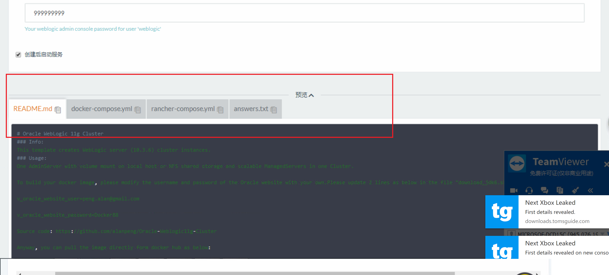
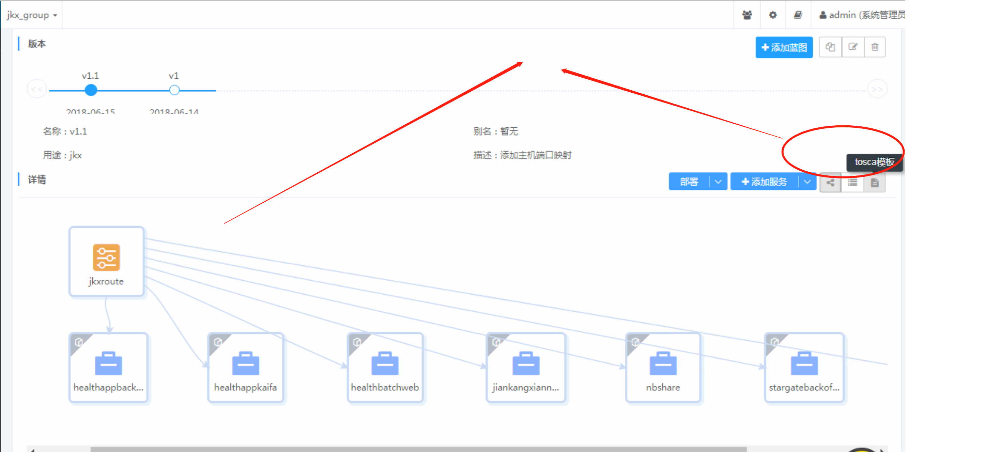
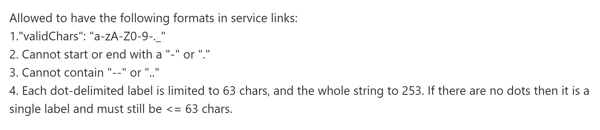
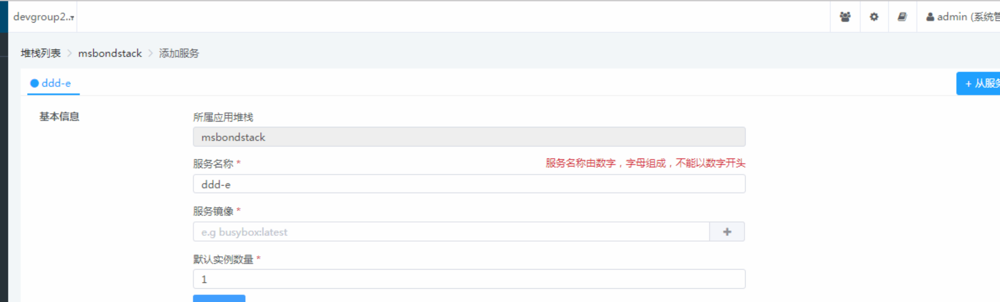

### 迁移问题之stack编排

#### 1、 wisecloud迁移编排方式
rancher 应用编排依赖docker_compose.yml, rancher_compose.yml ， answers.txt 文件共同完成。

但wisecloud + k8s环境在应用编排实现上有所不同，wisecloud 支持由OASIS组织制定的云应用拓扑编排规tosca通用模版（Topology and Orchestration Specification for Cloud Applications）， TOSCA制定了一个用来描述云平台上应用的拓扑结构的标准，目前支持XML和YAML。


 这就需要在迁移时解读现有rancher应用编排的基础上，使用wisecloud平台在图形界面手工重新设计应用蓝图。
 #### 2. wisecloud 应用编排迁移注意事项

使用wisecloud界面将原有rancher应用迁移需要注意以下几点：


 * 服务发现机制

   rancher cattle 下原有的编排大致有以下几点不受wisecloud平台支持，具体包括：
   1. confd+metadata方式
   rancher-metadata灵活性好，比较复杂的微服务架构可以通过metadata实现一定程度的解耦， 故原有应用编排及镜像构建过程中常会采用使用一些容器启动脚本或构建命令调用Rancher的元数据服务来完成一些比较灵活的启动容器任务。
   2. 以特殊字符命名的服务名
    rancher 环境的服务名命名规范支持连字符，但在wisecloud+ k8s下，命名规范更加严格些。 如果原有服务器不合规，需要在k8s新建蓝图时变更为合规的服务名（当然，意味着如果容器内有程序调用服务名的话，代码调用的服务名也相应的变更 ）
      * **原有rancher 服务名规范如下：**
      
      * Wisecloud + k8s 环境服务名命名规范
      仅仅支持字母加数字，不支持数字开头。
      

    注：kubernetes 采用coreDNS作为默认的服务发现机制，当前coreos 对dns服务解析名称没有明确的限制，     https://coredns.io/manual/toc/#what-is-coredns
    coreos 支持的环境变量包括：
    {$ENV_VAR}   linux 语法
      windows 语法
    接受三个不同的协议：
    plain DNS, DNS over TLS ，  DNS over gRPC.
    ```dns:// for plain DNS (the default if no scheme is specified).
    tls:// for DNS over TLS.
    grpc:// for DNS over gRPC.  ```
    3. 权限问题
