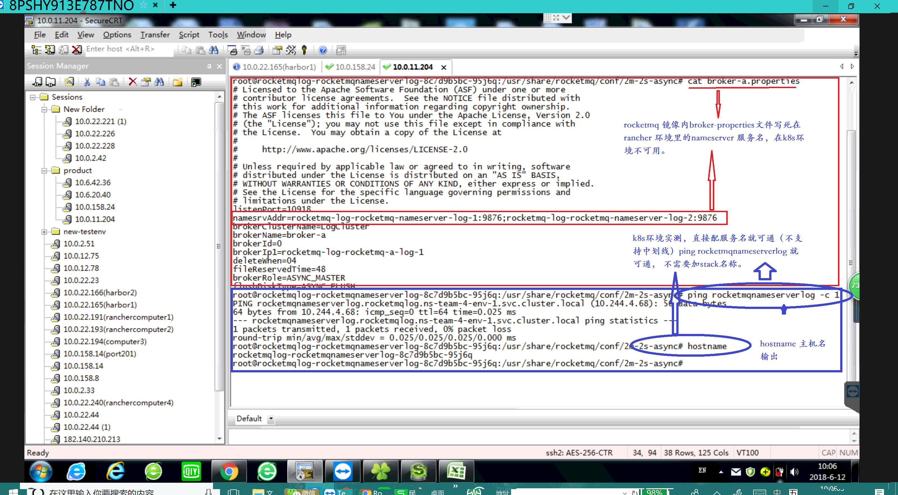

<!-- @import "[TOC]" {cmd="toc" depthFrom=1 depthTo=6 orderedList=false} -->
<!-- code_chunk_output -->

* [三、引起迁移困难的原因总结](#三-引起迁移困难的原因总结)
* [四、 迁移过程纪录](#四-迁移过程纪录)

<!-- /code_chunk_output -->

###  三、引起迁移困难的原因总结

1.   旧有环境启动脚本中调用rancher 元数据等（需要就具体case 变更脚本或镜像启动方式）
2.   原有应用或镜像集群中设置使用了k8s中不合规的服务名（例如带中划线）
3.   对外服务接口或应用程序中写死宿主机ip（在userinfochangestack中属于此种情况）

```
问题1.  原有镜像里是什么原因导致必须使用 **rancher-gen** 脚本来获取web-app 服务容器的rancher 网络的ip (10.42段)，并reload 到nginx 配置。 为什么不直接使用服务名。

问题2.   现有依赖userinfochangestack（客户信息管理系统）依赖哪些栈外的服务。 服务创建后检查是否可用的命令或标准是什么

问题3.  整理对外的服务端口及ip 访问方式

问题4. rocketmq 应用相关，评估是否需要做架构或代码级的调整、修改。
```
4.  现有wisecloud 平台编排每一次升级都会默认策略完整的保留以备回退。可使用rollout history 命令查看到相关的历史版本，具体如下：
````
[root@k8s01 ~]# kubectl  -n ns-team-4-env-1  rollout history deployment cmdb-cmdbwebapp
deployments "cmdb-cmdbwebapp"
REVISION  CHANGE-CAUSE
1         <none>
3         <none>
5         <none>
8         <none>
9         <none>
11        <none>
12        <none>
13        <none>
15        <none>
16        <none>
17        <none>
18        <none>
19        <none>
````
为节约资源 ， 可以设置 Deployment 中的 .spec.revisionHistoryLimit 项来指定保留多少个旧的 ReplicaSet。 余下的将在后台被当作垃圾收集。我推荐在当前开发环境中将设置更改为 2或3。
注意： 将该值设置为 0，将导致该 Deployment 的所有历史记录都被清除，也就无法回退了。


### 四、 迁移过程纪录
* ###   4.1  Rocketmq 应用栈
  1.  当前k8s环境服务名命名规则只能有字母和数字 ，不支持中划线-等。在原有民生的rancher环境内服务名大部包含中划线等特殊字符命名见 查看整体统计详细情况。

  2.  rocketmq 服务只能在k8s环境编排时去掉所有中划线命名。如下图:
   　　
  3.  服务启动失败， 检查确认rocketmq 镜像需要修改。
  当前环境中nameserver console等启动正常， broker 节点有问题
  
  4.  发现在启动容器过程中，使用命令调用的broker-a.properties 。而broker-a.properties文件中没有定位到k8s中nameserver的服务名（原有文件写死rancher内服务名(含中划线)， 确认并修正如下。
  
  
